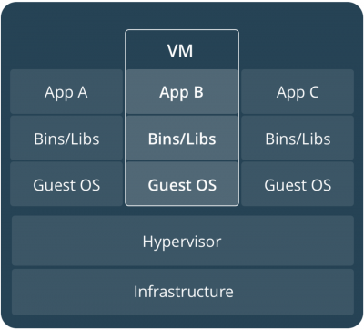
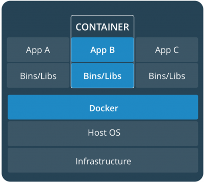
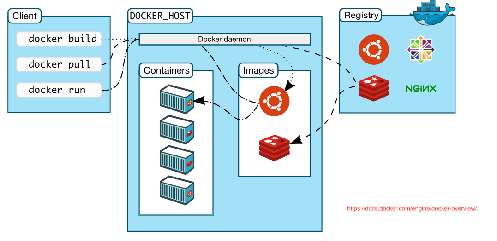
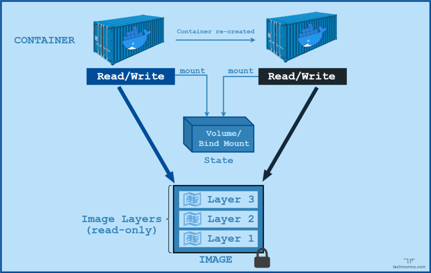

# My Docker 🐳 Notes

## Content

1.  [Introduction To Docker](#introduction-to-docker)
2.  [Docker Architecture](#docker-architecture)
3.  [Docker Image](#docker-image-in-depth)
4.  [Docker Container](#docker-container-in-depth)
5.  [Docker Data Management](#docker-volumes-and-data-management)
6.  [Docker Networking](#networking-with-docker)
7.  [Docker Image Building](#docker-build)
8.  [Docker Environment Variables](#docker-env)
9.  [Docker Compose](#docker-compose)
10.  [Docker Secrets Managements](#docker-secrets)

## Introduction To Docker

> *   **Docker is a program set of serval services , it Used to develope,package,ship,run your app on any platform**
>     
>     
> *   **Docker is a soluation for "it worked on my machine !. i don,t know why it don,t run on yours " it is a popualr statement between developer and client.**
>     
>     
> *   **Docker is more about managing your infrastructure , Docker provides a consistent way to package, ship and run your application across DTAP (Development, Testing, Acceptance, and Production) environment.**
>     
>     
> *   **Docker is based on the Linux kernel cgroup, namespace, and AUFS to encapsulate the process of isolation. The isolation environment that Docker creates is called a container.**

## Docker Vs VM

1.  #### VM 🖥️

> 1.  **full copy of Guest OS is installed on top of the Host machine. These Guest os can be of few Gbs, where the hosted app is just of few Mbs**
>     
>     
> 2.  **Hypervisors like QEMU,virtualbox,vmware needed to manage Guest VM**
>     
>     
> 3.  **Heavyweight && Difficult to monitor && time taking**

1.  #### Docker 🐳

> 1.  **Docker engine run the image in an isolated runtime called docker container.**
>     
>     
> 2.  **The application only needs to be packed with its dependencies libraries**
>     
>     
> 3.  **lightweight and powerful than VM && easy to manage u can start a container of app image in just few seconds with few commands**

* * *

## Docker Architecture

> *   #### Docker Architecture Contain
>     
>     
>     1.  **Docker Daemon**
>     2.  **Docker client**
>     3.  **Docker Registries**
>     4.  **Docker Image**
>     5.  **Docker Container**
>     6.  **Docker Host**
>     7.  **Docker Compose**
>     8.  **Docker Machine**
>     9.  **Docker Swarm Mode**

### 1\. Docker Daemon

> *   **Docker Daemon (dockerd) also called docker engine is a background process running and manages Docker images, containers, networks, and storage volumes Through a REST API .**

### 2\. Docker Client

> *   **Docker Client almost it was cli binary which called docker , it communticate with docker Useing Commands like `docker pull` or `docker run` , This Commands sended Useing REST API message sructure to docker-engine (dockerd) to manage && control images, containers, networks , ...etc .**

### 3\. Docker Registry

> *   **Docker Registry is the main repo where all images are stored ,Docker Hub is the public Official Registry contain alot of images you can download and run instance of it , You Can use Docker Hub like github extacly it use pull requests and push and commits but for images you can try commands like `docker pull` and `docker run` to pull and run images directly to your machine .**

### 4\. Docker Image

> *   **Docker Image is a read-only template and contains instruction for createing a Docker Container , You can inherit nad reuse base images to create a new custom image based on your needs .**
>     
>     
> *   **To Create a Docker image You Should Use a file with name : Dockerfile and write dependencies and control flow inside it then run `docker build --tag <image>:<tagname> /path/to/dockerfile`**

### 5\. Docker Container

> *   **Docker Container can called be an runnable instance of an image running in an isolated process, you can run,start,stop,delete,attach containers .**
> *   **_If you’re familiar with *_`chroot`** (like nethunter "kali linux for mobile" which use **`chroot`** in kernel mode or **`proot`** for User land like termux ), you can think of a container as an extended version of chroot. The filesystem is simply coming from the image. But, a container adds additional isolation not available when simply using chroot._*_

### 6\. Docker Host

> *   **Docker Host is the machine which contain docker installed .**

### 7\. Docker Machine

> *   **Docker Machine is a tool for provisioning and managing your Dockerized hosts (hosts with Docker Engine on them). Typically, you install Docker Machine on your local system. Docker Machine has its own command line client docker-machine --help and the Docker Engine client, docker.**

### 8\. Docker Swarm

> *   **Docker uses swarm mode to manage clusters of docker-engines. Cluster is also known as Swarm. Use docker swarm --help to know the commands to manage a swarm. The popular tool Kubernetes somewhat killed this tool**

### 9\. Docker Compose

> *   **Docker compose is loved by developers, to define and run multi-container docker applications. Usually, use docker-compose.yml to define the containers and use docker-compose --help commands to build, run and manage the containers. Docker compose is production ready.**

* * *

## Docker Image In Depth

> *   **Docker image can be build form Dockerfile , are you can pull a published image from docker hub or any other docker registry.**  
>     _Syntax :_ `docker image <Option> <image:tag>`  
>     _Run :_ `docker image --help`_for more info about usage_
>     
>     
> *   **`docker pull image:tag`** or **`docker image pull image:tag`** to pull image from remote or local docker registry _example :_ `docker image pull debian:latest`, this will pull debian image from docker hub
>     
>     
> *   **`docker image ls -a`** or **`docker images`** to list installed images
>     
>     
> *   **`docker image ls <image>`** to list spefic image or similar images with the same name
>     
>     
> *   **`docker run <image:tag> <command>`** to run instance of docker image in isolated container  
>     _example:_ `docker run -it --rm debian:latest bash` `-i` mean start a interactive session and redirect stdin of running image to current stdin , and `-t` mean allocate a ney tty or terminal channel or session to interactive with shell of the running system  
>     `--rm` mean you told docker engine or daemon to delete container after it exists by default any container you run didn,t be deleted automaticly untill you specify this flag `--rm`
>     
>     
> *   **`docker image rm <image:tag>`** Or **`docker rmi <image:tag>`**, for deleteing images image .  
>     _example:_ `docker image rm <debian:latest>`
>     
>     
> *   **`docker build --tag <image:name> /path/to/Dockerfile`** , to build image from docker  
>     _example:_ **`docker build --tag crypt00o:latest .`** , where Dockerfile located in the same directory
>     
>     
> *   **`docker tag local-image:tag new-repo:tag`** , for tagging a local image to a repo
>     
>     
> *   **`docker push new-repo:tag`** , for pushing a new image or repo for docker registry
>     
>     
> *   **`docker image inspect <image:tag>`** ,get all info about spefic image
>     
>     
>     
>     _example:_ `docker image inspect debian`
>     
>     
> *   **`docker image history <image:tag>`** , docker images are made up of multiple layers to know more about an image history use this command  
>     _example:_ `docker image history debian`
>     
>     
> *   **`docker image load -i /path/to/imagefile.tar`** , loading image form an exported container system or exported image as tar archive
>     
>     
> *   **`docker image import -i /path/to/imagefile.tar`** , same as above but just import it
>     
>     
> *   **`docker image purne`** , for Removeing all images
>     
>     
> 
> ### How multilayered implementation works?
> 
> *   **_In docker, each image is made up of multiple layers. Docker uses Union FS to combine these layers into one final image._**
>     
>     
> *   **_Union Fs has 2 purposes, (i) multiple disks can be linked to the same directory, (ii) Unionfs allows any mix of read-only and read-write branches, as well as insertion and deletion of branches anywhere in the fan-out._**

## * * *

## Docker Container in Depth

> *   **Docker Container can called be an runnable instance of an image running in an isolated process, you can run,start,stop,delete,attach containers .**
>     
>     
> *   **`docker container run image:tag`** , to run instance of docker image in new isolated container  
>     _example:_ `docker container run -it --rm --name crypt00o_container debian:latest bash` ,  
>     where crypt00o_container is the new name of the new contianer
>     
>     
> *   **`docker contianer ls`** ,for Listing containers
>     
>     
> *   **`docker contianer ps`** ,same as above command  
>     _example:_ `docker container ls -a`  
>     , `-a` ir `-all` to list all containers , ls by default without any flags it display running containers only ,  
>     `-q` for showing containers ids only
>     
>     
> *   **`docker container start container_id`** , for Starting one or more stopped containers  
>     _example:_ `docker container start -i 86ebe40d8619` , where 86ebe40d8619 is an id of running container
>     
>     
> *   **`docker container stop contianer_id`** , for Stoping one or more running containers
>     
>     
> *   **`docker container restart container_id`** for Restarting one or more running containers
>     
>     
> *   **`docker container attach container_id`** , for attaching stdin,stdout,stderr for a running container
>     
>     
> *   **`docker container rm container_id`** , for Removeing one or more containers
>     
>     
> *   **`docker container cp container_id:/path /path/on/filesystem`** , for copying file from a spefic path on container filesystem to spefic path on host filesystem
>     
>     
> *   **`docker container cp /path/on/filesystem container_id:/path`** , for copying file from a spefic path on host filesystem to spefic path on container filesystem
>     
>     
> *   **`docker contianer exec container_id <new command>`**, for Running a command inside a running container
>     
>     
> *   **`docker contianer kill contianer_id`** , for killing a Running Container you can speficy spefic kill signal useing `--signal` followed with signal name or number
>     
>     
> *   **`docker contianer pause contianer_id`** , for pauseing a running contianer
>     
>     
> *   **`docker container unpause contianer_id`** , for run a paused contianer
>     
>     
> *   **`docker container logs contianer_id`** , for report logs(stdin,stdout,stderr) , and you can continue track any new changes with `-f` or `--follow` flags
>     
>     
> *   **`docker container stats contianer_id`** , for displaying a live stream of container resource changes and observer Usage it (net,io,mem,cpu)
>     
>     
> *   **`docker container top container_id`** , for Display the running processes of a container
>     
>     
> *   **`docker container diff container_id`** , for Display changes to files or directories on a container's filesystem
>     
>     
> *   **`docker container commit contianer_id newimagename:tag`** , for Createing a new image from a container's changes
>     
>     
> *   **`docker container export contianer_id -o /path/to/outfile.tar`** ,Export a container's filesystem as a tar archive
>     
>     
> *   **`docker container inspect contianer_id`** , to get inforamtion and current config of a spefic container
>     
>     
> *   **`docker container purne`** for deleteing all containers

* * *

## Docker Volumes and Data Management

> _By default, all files created inside a container are stored on a writable container layer. Which means:_  
> **_1\. The data doesn’t persist when that container no longer exists, and it can be difficult to get the data out of the container if another process needs it._**  
> **_2\. A container’s writable layer is tightly coupled to the host machine where the container is running. You can’t easily move the data somewhere else._**  
> **_3.Writing into a container’s writable layer requires a storage driver to manage the filesystem. The storage driver provides a union filesystem, using the Linux kernel. This extra abstraction reduces performance as compared to using data volumes, which write directly to the host._**

#### There are 2 ways to manage data in a container:

> **_1\. Using Data Volumes – run `docker volume --help` for more info._**  
> **_2\. Mount host directory – Bind mounts._**

### 1\. Useing A Data Volumes

#### Docker Volumes

**_Volumes are stored in a part of the host filesystem which is managed by Docker (/var/lib/docker/volumes/ on Linux). Non-Docker processes should not modify this part of the filesystem. Volumes are the best way to persist data in Docker and can be shared with multiple containers._**

> *   **`docker volume create volume_name`** , for createing a volume
>     
>     
> *   **`docker volume ls`** , for Listing volumes
>     
>     
> *   **`docker volume inspect volume_name`** ,for getting information about volume
>     
>     
> *   **`docker volume rm volume_name`** , for Removeing Volumes
>     
>     
> *   **`docker volume purne`** , for Removeing all volumes
>     
>     
> *   _To Use Docker volume while running container_ **`--mount source=volume_name,destination=/mount_point_on_container,<optional readonly>`**
>     
>     
> *   _Another Way :_ **`-v volumes:/mount_point_on_container`**
>     
>     
> 
> _example:_  
> `docker volume create crypt00o_volume`  
> `docker image pull debian:latest`  
> `docker container run --rm -it --name crypt00o_container --mount source=crypt00o_volume,destination=/crypto debian:latest`  
> _running volume as readonly:_ `docker container run --rm -it --name crypt00o_container --mount source=crypt00o_volume,destination=/crypto,readonly debian:latest`

### 2\. Mount host directory

_To make a Container can read or read and write data on The Main Host_ **`--mount type=bind,source=volume_name,destination=/mount_point_on_container,<optional readonly>`**

> _example:_  
> `docker volume create crypt00o_volume`  
> `docker image pull debian:latest`  
> `docker container run --rm -it --name crypt00o_container --mount source=/tmp,destination=/crypto debian:latest`  
> _running volume as readonly:_ `docker container run --rm -it --name crypt00o_container --mount source=/tmp,destination=/crypto,readonly debian:latest`

* * *

## Networking With Docker

> **_Mapping ports_**
> 
> *   **`-p host_port:container_port`** , to forward a port from host to container
>     
>     
> *   **`-p host_ip:host_port:container_port`** , to forward a port from spefic host or ip to container
>     
>     
> *   **`-p host_ip::container_port`** , to forward all ports of spefic host to spefic container port
>     
>     
> *   **`/tcp` or `/udp` `-p host_port:container_port/udp`** , use with all of above to determine if tcp or udp
>     
>     
> *   **`docker port contianer_id`** , to view the current port configuration mapping, you can also view the address binding
>     
>     
> 
> _examples:_  
> `docker container run --rm -it --name crypt00o_container -p 80:3000 debian:latest npm start`  
> `docker container run --rm -it --name crypt00o_container -p 192.168.1.109:80:3000 debian:latest npm start`  
> `docker container run --rm -it --name crypt00o_container -p 127.0.0.1:80:3000/udp debian:latest bash`  
> `docker container run --rm -it --name crypt00o_container -p 127.0.0.1::3000 debian:latest npm start`  
> `docker port crypt00o_container`

### Docker network Core

> Docker’s networking subsystem is pluggable, using a specific driver. Understand which driver best suits your purpose based on the below:
> 
> *   **_bridge – User-defined bridge networks, best for connecting multiple containers on the same host to communicate._**
> *   **_host – Host networks, best when network stacks not to be isolated from the docker host._**
> *   **_overlay – Overlay networks, best when multiple containers running on different hosts to communicate, or multiple applications works together using docker swarm._**
> *   **_macvlan – Macvlan networks, best when migrating from a VM setup or containers need to look like physical hosts._**

#### Docker Network

> *   **`docker network create -d <host|overlay|macvlan|bridge> network_name`** , create new network
>     
>     
> *   **`docker network inspect network_name`** , get network config and info
>     
>     
> *   **`docker network ls`** , list networks
>     
>     
> *   **`docker network rm network_name`** , delete one or more network
>     
>     
>     
>     **`docker network prune`** , delete all networks
>     
>     
> 
> _example:_  
> `docker create network -d bridge crypt00o_network` , if you face any problems in iptables with your debian distro like me :D , ( cause i use kali(debian based distro) just restart the docker again by `sudo service docker restart` and try createing docker network again .  
> `docker run --rm --name crypt00o_container -it -p 3000:4000 --network crypt00o_network debian:latest bash`

* * *

## Docker Build

> **_In order to build the container image, we need to use a Dockerfile. A Dockerfile is simply a text-based file with no file extension. A Dockerfile contains a script of instructions that Docker uses to create a container image._**
> 
> *   **`FROM <image name>:<tag name>`**  
>       
>     A FROM command allows you to create a base image such as an operating system, a programming language, etc. All the instructions executed after this command take place on this base image.  
>       
>       
>     
> *   **`RUN <command>`** or **`RUN [<command>, <arg1> , arg2>, ... ]`**  
>       
>     A RUN instruction is used to run specified commands. You can use several RUN instructions to run different commands. But it is an efficient approach to combine all the RUN instructions into a single one.A RUN instruction is used to run specified commands. You can use several RUN instructions to run different commands. But it is an efficient approach to combine all the RUN instructions into a single one.  
>       
>     _example:_  
>     `RUN apt update`  
>     `RUN apt install nodejs npm` is bad ❌  
>       
>     `RUN apt update\`  
>     `&& apt install nodejs npm` is Better ✅  
>       
>       
>     
> *   **`CMD <executable_file>`** or **`CMD [<executable_file> , <arg1> ,<arg2>,...]`**  
>       
>     to Run Final Executable file or Command , You Should Have Always One CMD Docker Command inside your Dockerfile , if you have more than one CMD statement then just the last one only which will be executed .  
>       
>     _example:_ : `CMD ["npm","run","start"]`  
>       
>       
>     
> *   **`ENTRYPOINT <command>`** or **`ENTRYPOINT [<command>,<arg1>,<arg2>,<arg3>]`**  
>       
>     Just Like Cmd but if you use it with cmd then it will take CMD just as args likeexample:  
>       
>     _example:_ `ENTRYPOINT ["echo","hello,"iam"]`  
>     `CMD ["eslam","mohamed"]`  
>     Output will be hello iam eslam mohamed  
>       
>       
>     
> *   **`WORKDIR <path>`**  
>       
>     WORKDIR Docker Command Specify the current working directory , You Can Use more than WORKDIR in the same docker file but the ecery command executed after the workdir above it , WORKDIR aslo create a directory if the path you provide to it as argument doesn,t exists  
>       
>     _example:_  
>     `WORKDIR /app`  
>     `RUN pwd`  
>     `WORKDIR /app2`  
>     `RUN pwd`  
>     Output will be :  
>     /app  
>     /app2  
>       
>       
>     
> *   **`COPY <src path on host> <dst path on image>`**  
>       
>     This Command Copy a filr or directory from host to docker image  
>       
>       
>     
> *   **`ADD <can be URL path or Path to file> <dst path on image>`**  
>       
>     work like Copy but it can work with urls , best practise to use `curl` executable file instead  
>       
>       
>     
> *   **`ENV <env_var_name>=<env_var_value>`**  
>       
>     ENV Command Used to set global environment variables .  
>       
>     _example:_  
>     `ENV MYSQL_HOST="localhost" MYSQL_PORT=3306 MYSQL_USER="Crypt00o" MYSQL_PASSWORD="somepassword" MYSQL_DB="test"`  
>       
>       
>     
> *   **`LABEL <metadata_label>=<metadata_value>`**  
>       
>     adding meta data for your building image for example adding a description to your image  
>       
>       
>     
> *   **`EXPOSE <portnumber>`** or **`EXPOSE <portnumber>/<tcp|udp>`**  
>       
>     The EXPOSE instruction informs Docker that the container listens on the specified network ports at runtime. You can specify whether the port listens on TCP or UDP, and the default is TCP if the protocol is not specified. The EXPOSE instruction does not actually publish the port. It functions as a type of documentation between the person who builds the image and the person who runs the container, about which ports are intended to be published. To actually publish the port when running the container, use the -p flag on docker run to publish and map one or more ports, or the -P flag to publish all exposed ports and map them to high-order ports.

### Example OF B Docker App

Content of a `./Dockerfile` :

    FROM alpine:latest
    WORKDIR /app
    RUN apk add nodejs npm --no-cache \
    && npm i cryptopress -g \
    && cryptopress 
    ENV PORT=3001
    EXPOSE 3001/tcp
    ENTRYPOINT ["npm","run"]
    CMD ["start"]

build your image

`docker image build -t cryptopress_image:latest .`

run new image in new container `docker container run -it --rm -p 80:3000 cryptopress_image:latest`

visit [http://128.0.0.1](http://128.0.0.1) from your browser you will find response : {"Server":"0xDrypt00o Server is Working !","PowerdBy":"Eslam Mohammed"}

* * *

## Docker Env

> Environment Variables are dynamic variables in the Environment Variables of Operating Systems , Every process Extends the Environment Process variables by default so it can be shared and accessed  
>   
>   
> You Can Set Environment vars in docker useing **`ENV`** While Building an image from a Dockerfile or while running a container Through :  
> 
> *   **`docker container run --env <env_var>=<env_value> <image name>:<image_tag>`**  
>       
>     
> *   **`docker container run --env-file /path/to/envfile <image name>:<image_tag>`**
> 
>   
>   
> _example if you build image(cryptopress_image) from dockerfile above :_ :  
> `docker container run --rm -it -p 80:9090 --env PORT=9090 cryptopress_image:latest`  
>   
> _another example :_ content of `./.env` file: `PORT=9091`  
>   
> 
> `docker container run --rm -it -p 80:9090 --env-file ./.env cryptopress_image:latest`

* * *
## Docker Compose
